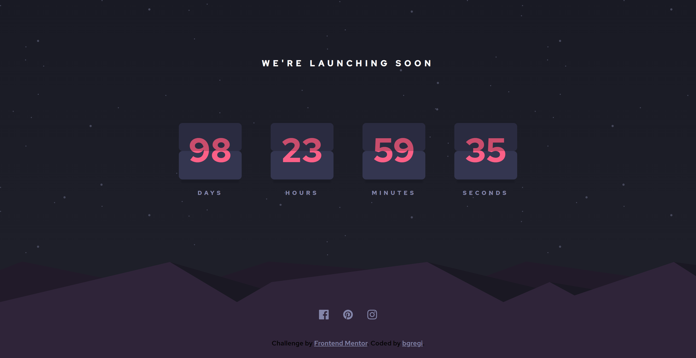

# Frontend Mentor - Launch countdown timer solution

This is a solution to the [Launch countdown timer challenge on Frontend Mentor](https://www.frontendmentor.io/challenges/launch-countdown-timer-N0XkGfyz-). Frontend Mentor challenges help you improve your coding skills by building realistic projects. 

## Table of contents

- [Overview](#overview)
  - [The challenge](#the-challenge)
  - [Screenshot](#screenshot)
  - [Links](#links)
- [My process](#my-process)
  - [Built with](#built-with)
  - [What I learned](#what-i-learned)
- [Author](#author)

## Overview

### The challenge

Users should be able to:

- See hover states for all interactive elements on the page
- See a live countdown timer that ticks down every second (start the count at 14 days)
- **Bonus**: When a number changes, make the card flip from the middle

### Screenshot

### Links

- Solution URL: [https://github.com/bgregi/launch-countdown](https://github.com/bgregi/launch-countdown)
- Live Site URL: [https://bgregi.github.io/launch-countdown](https://bgregi.github.io/launch-countdown)

## My process

### Built with

- CSS custom properties
- SASS
- Flexbox
- Mobile-first workflow
- Javascript

### What I learned

I found this project to be pretty interesting and useful. I had to research about dealing with time in JavaScript, which I had never used in a solo project before. Once I found a source for the countdown function, I understood it pretty well, and was able to easily implement it. Though I wanted to come up with a solution myself, I didn't want to spend much time in this challenge, so I just used the function I found on the internet. The bonus challenge was to make the a "flip" animation for the cards, and I found a solution for that, but decided not to use it, because I thought it was much ahead of my current abilities and it would take some time.

## Author

- Website - [bgregi's GitHub Profile](https://github.com/bgregi)
- Frontend Mentor - [@bgregi](https://www.frontendmentor.io/profile/bgregi)